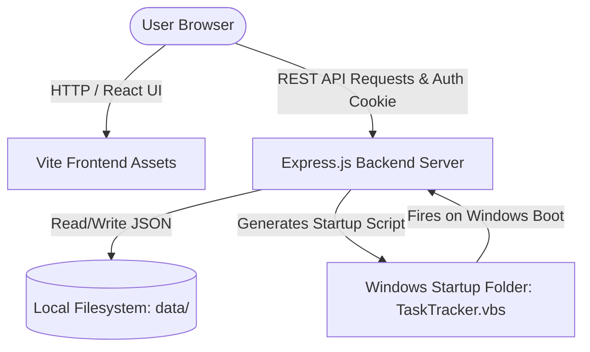

# Track. 🚀

**Track.** is a premium, localized, multi-project task management and scheduling application. It combines a robust **React 18** client, a **Vite** bundler, and a local **Express.js** backend server. It features an interactive Gantt chart, responsive statistics dashboards, customizable accent themes, and native Windows startup integration.

All user databases are stored locally, prioritizing complete offline privacy.

---

## 🌟 Key Features

*   **📊 Dynamic Dashboard & Weekly Focus Summary:** Get instant overview of project progress, task ratios, immediate priorities, and a dynamic 7-day bar chart showing logged time.
*   **📅 Interactive Gantt Chart:** Visualizes project timelines. Supports multi-project filtering, day/hour scheduling resolution, hover tooltips, and task editing directly from the timeline.
*   **🔒 Secure Local Auth:** Local user registrations verified via unique salt generation and PBKDF2 SHA-512 password hashing. Secure cookie session storage (`session_token`) keeps you logged in.
*   **📂 Private Local Database:** Zero cloud dependencies. All databases, projects, and task files are stored locally in the `data/` directory.
*   **🎨 Custom Accent Themes:** Personalized aesthetics. Instantly toggle between accent themes (Violet, Teal, Rose, Blue, Amber, Emerald) via custom HSL-based CSS variables.
*   **⚙️ Windows Boot Integration:** Schedule/unschedule automatic boot on login directly from the Settings UI. Writes a background VBScript process to your Windows Startup folder (`%APPDATA%`) to run the Node.js process silently.
*   **📝 Sub-tasks & Checklists:** Break tasks into step-by-step items. Render completion progress bars and toggle checklists directly on Kanban cards.
*   **⏱️ Precision Time Tracking:** Run live start/stop timers on task cards with smart auto-pause of other active timers, and maintain historical session logs.
*   **🔄 Task Recurrence:** Configure daily, weekly, or monthly recurrence intervals that automatically clone tasks forward upon completion.
*   **🔍 Global Ctrl+K Search Palette:** Trigger a glassmorphic command palette with `Ctrl+K` to search across all project names, task titles, and task descriptions.
*   **🍅 Pomodoro Focus Timer:** Run 25m work / 5m break sessions linked to tasks, complete with arpeggio completion chimes and auto task time logging.

---

## 🛠️ Tech Stack

*   **Frontend:** React 18, Vite, HSL-tailored Vanilla CSS, Tailwind CSS, FontAwesome 6 Icons, Outfit & Plus Jakarta Sans Google Fonts.
*   **Backend:** Node.js, Express.js, Cookie-Parser (cookie-based session state).
*   **Security:** Cryptographic pbkdf2Sync password hashing, UUIDv4 identifiers.
*   **Database:** Native Node `fs` (file system) read/write of structured JSON database collections.

---

## 🏗️ Architecture Flow



---

## 📁 Directory Structure

```text
Track/
├── data/                             # LOCAL FILE DATABASE (Gitignored)
│   ├── users.json                    # Hashed user registry
│   └── user_<userId>.json            # User-specific projects & tasks
├── dist/                             # Compiled production assets
├── src/                              # React application source code
│   ├── components/                   # Restructured sub-components
│   │   ├── Auth/                     # Authentication components
│   │   │   ├── Auth.jsx
│   │   │   └── Auth.css
│   │   ├── Dashboard/                # Dashboard & weekly time stats
│   │   │   ├── Dashboard.jsx
│   │   │   └── Dashboard.css
│   │   ├── GanttChart/               # Timeline schedule visualization
│   │   │   ├── GanttChart.jsx
│   │   │   └── GanttChart.css
│   │   ├── Modals/                   # Modals (Sub-tasks/Recurrence settings)
│   │   │   ├── Modals.jsx
│   │   │   └── Modals.css
│   │   ├── ProjectDetail/            # Kanban board & checklists card
│   │   │   ├── ProjectDetail.jsx
│   │   │   └── ProjectDetail.css
│   │   ├── Settings/                 # Accent themes & startup
│   │   │   ├── Settings.jsx
│   │   │   └── Settings.css
│   │   ├── GlobalSearch/             # Command palette (Ctrl+K) component
│   │   │   └── GlobalSearch.jsx
│   │   └── Pomodoro/                 # Focus timer (Web Audio chime)
│   │       └── Pomodoro.jsx
│   ├── App.jsx                       # State coordination & navigation
│   ├── main.jsx                      # App mount entry point
│   └── index.css                     # Global styles, variables, scrollbars
├── index.html                        # Application main template
├── server.js                         # Local REST API backend
├── package.json                      # Build scripts and dependencies
├── vite.config.mjs                   # Vite dev server & compile configuration
├── start.bat                         # Startup utility script (Windows)
├── stop.bat                          # Server termination script (Windows)
└── POSTMAN_GUIDE.md                  # Rest API testing documentation
```

---

## 🚀 Getting Started

### 📋 Prerequisites
Make sure you have **Node.js** (v14.0+) installed on your machine. Download it from [nodejs.org](https://nodejs.org/).

### 💻 Launching the Application (Windows)
1. **Start the App:** Double-click the `start.bat` file in the root directory.
   * This script automatically installs dependencies (`npm install`) on first run, builds the React app bundle (`npm run build`), and fires up the backend server in the background silently.
   * The app runs locally on `http://localhost:3000`.
2. **Access the App:** Open your browser and go to `http://localhost:3000`.
3. **Stop the App:** Double-click `stop.bat` to safely terminate the background process listening on port `3000`.

> [!NOTE]
> **Database Setup:** Since the local data directory is gitignored to protect user privacy, the server will automatically create the `data/` folder and initialize a fresh, empty `users.json` file when started for the first time. No manual database setup is required.

### 🛠️ Development Mode (Cross-Platform)
For active development with Hot Module Reloading (HMR):
```bash
# Install dependencies
npm install

# Start development server (backend + front-end dev servers concurrently)
npm run dev
```
* Client dev server will listen on `http://localhost:5173`.
* Express API backend will listen on `http://localhost:3000`.
* Vite proxy routes `/api/*` requests to the Express server automatically.

---

## 🔌 API Endpoints Summary

All requests require authentication cookies except signup/login. Refer to the [Postman Testing Guide](file:///d:/My_Web_Code/Track/POSTMAN_GUIDE.md) and [Postman Collection File](file:///d:/My_Web_Code/Track/Track_API_Postman_Collection.json) for more details.

| Method | Endpoint | Description |
| :--- | :--- | :--- |
| **POST** | `/api/auth/signup` | Register a new local account |
| **POST** | `/api/auth/login` | Log in and receive auth cookie |
| **POST** | `/api/auth/logout` | Clear session cookies |
| **GET** | `/api/auth/me` | Fetch active user information |
| **GET** | `/api/projects` | Fetch all user projects |
| **POST** | `/api/projects` | Create a new project |
| **PUT** | `/api/projects/:id` | Update a project's metadata |
| **DELETE**| `/api/projects/:id` | Delete a project and all its tasks |
| **POST** | `/api/projects/:projectId/tasks` | Add task to a specific project |
| **PUT** | `/api/projects/:projectId/tasks/:taskId` | Edit task properties or status |
| **DELETE**| `/api/projects/:projectId/tasks/:taskId` | Delete a task |
| **GET** | `/api/settings/startup` | Get Windows startup status |
| **POST** | `/api/settings/startup` | Enable/Disable Windows startup |
